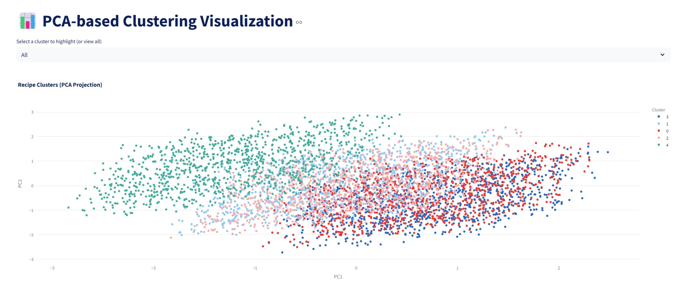
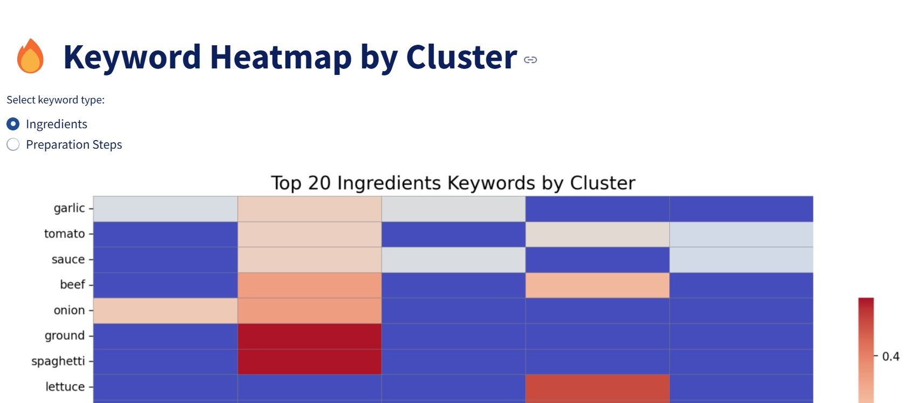
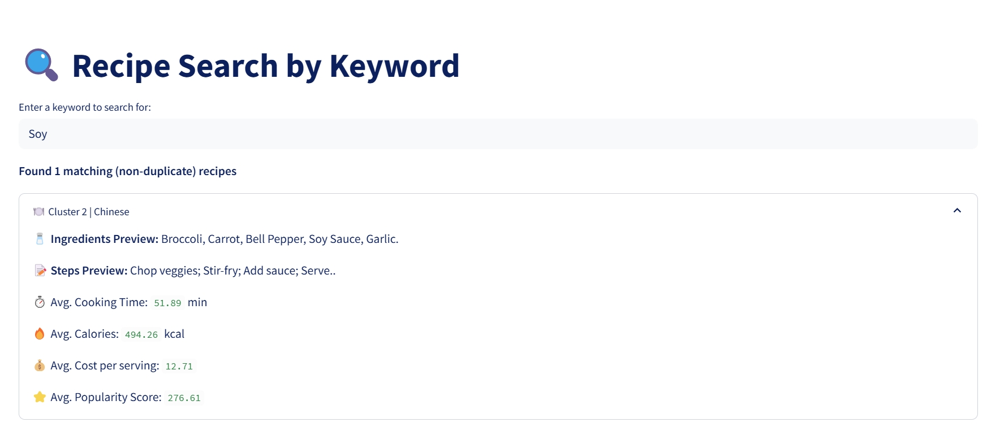

# 🍽️ Recipe Clustering Web App

This Streamlit-based interactive web application allows users to explore clustering results from a recipe dataset.  
It visualizes recipe clusters, analyzes keyword distributions, and supports ingredient-based search, providing insights into different cuisines and food preparation patterns.

---

## 📌 Project Overview

The goal of this project is to apply unsupervised machine learning techniques to analyze and visualize patterns in 5,000 diverse recipes.  
By using K-Means clustering, PCA for dimensionality reduction, and keyword analysis via TF-IDF, we reveal meaningful groups of recipes and their distinguishing features.

---

## 🧠 Methodology Summary

### 🔹 Preprocessing

- Fill missing values (numerical → median, categorical → "Unknown")  
- Standardize numerical features (time, calories, cost, popularity)  
- Extract keyword vectors from `Ingredients_List` and `Preparation_Steps` using TF-IDF  
- One-hot encode `Cuisine_Type`, `Difficulty_Level`, and `User_Preferences`  
- Combine all into a single feature matrix  

### 🔹 Clustering

- Use the Elbow Method and Silhouette Score to select optimal K  
- Apply KMeans clustering and store results in `Cluster`  

### 🔹 Dimensionality Reduction

- Apply PCA to reduce feature space to 2D for visualization  
- Visualize results via interactive scatter plot (by cluster)  

### 🔹 Feature Analysis

- Compute average feature values per cluster  
- Analyze TF-IDF keyword distributions via heatmaps  
- Use Random Forest to extract feature importances (Top 15)  

---

## 🗃 Dataset

- **Source:** [Kaggle - Comprehensive Recipe Dataset](https://www.kaggle.com/datasets/arifmia/comprehensive-recipe-dataset)  
- **Records:** 5,000 recipes  
- **Fields include:**  
  - Numerical: `Cooking_Time_Minutes`, `Calories_Per_Serving`, `Cost_Per_Serving`, `Popularity_Score`  
  - Text: `Ingredients_List`, `Preparation_Steps`  
  - Categorical: `Cuisine_Type`, `Difficulty_Level`, `User_Preferences`  

---

## 📷 App Preview

| Page | Description |
|------|-------------|
| 📊 PCA Visualization | Explore recipe clusters in 2D space |

| 🔥 Keyword Heatmap | View top keywords per cluster (ingredients/steps) |

| 🔍 Recipe Search | Search by keyword and view cluster-level average stats |

---

## 🔮 Future Work

- Visualize cluster summaries with charts  
- Deploy to public cloud  
